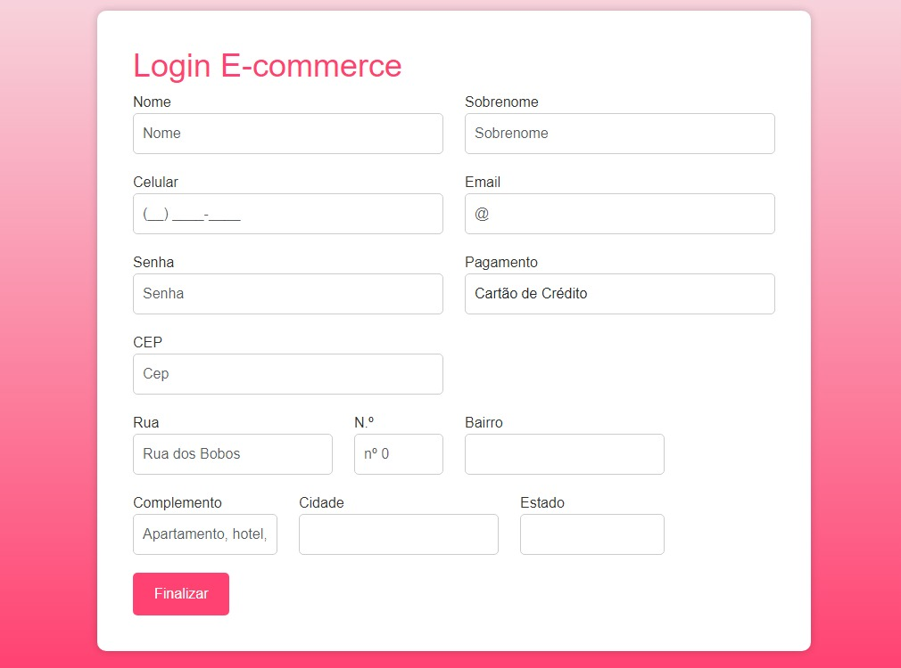

# E-commerce
[Ecommerce](#E-commerce)  
[Descrição](#descrição)  
[Introduçao](#introdução)  
[Funcionalidade](#funcionalidade)  
[Tecnologias Utilizadas](#tecnologias-utilizadas)  
[Fontes Consulta](#fontes-consulta)  
[Autores](#autores) 

# E-commerce

## Descrição
Este projeto é um sistema de e-commerce, que fornece uma plataforma online para compras e vendas de produtos ou serviços. O objetivo é criar uma experiência de compra conveniente e segura para os usuários.

## Introdução
Projeto com intuito de mostrar como funciona o E-commerce.

## Funcionalidade
A funcionalidade de um site de e-commerce (comércio eletrônico) é fornecer uma plataforma online para compras e vendas de produtos ou serviços.

## Tecnologias Utilizadas
* ``HTML5``
* ``CSS3``
* ``VSCODE``
* ``GITHUB``
* ``GIT``

## Fontes Consulta
* (https://exame.com/invest/guia/o-que-e-e-commerce-red04/)
## Autores
* Julia Eduarda de Lima Barbosa - Desenvolvedor